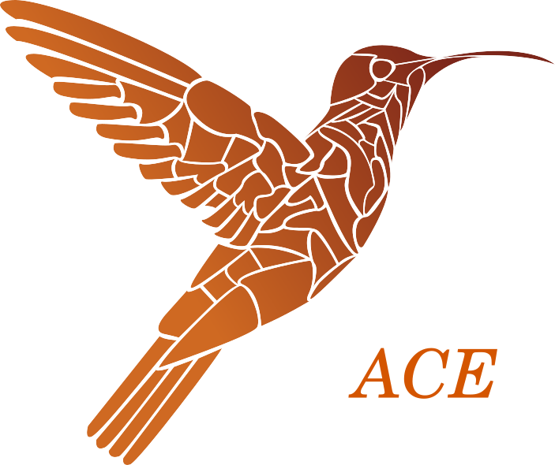

ACE is an open-source constraint solver developed by Christophe Lecoutre (CRIL, Univ. Artois) in Java.
ACE is embedded in the Python modeling library [PyCSP3](https://pycsp.org/), and is a competitive solver as shown by the results obtained at the [2022 XCSP3 competition](https://www.cril.univ-artois.fr/XCSP22/), the [2023 XCSP3 competition](https://www.cril.univ-artois.fr/XCSP23/) and the [2024 XCSP3 competition](https://www.cril.univ-artois.fr/XCSP24/).

The current stable version of ACE is 2.4 (August 28, 2024).

ACE focuses on:
- integer variables, including 0/1 (Boolean) variables,
- state-of-the-art table constraints, including ordinary, starred, and hybrid table constraints,
- popular global constraints (AllDifferent, BinPacking, Cardinality, Count, Cumulative, Element, Lex, MDD, Minimum, NoOverlap, NValues, Regular, Sum, Table, etc.),
- search heuristics (wdeg/dom, pick/dom, frba/dom, last-conflict, BIVS, solution-saving, ...),
- mono-criterion optimization

ACE is distributed under License MIT

## Quick Description

For some general information about the structure of the code of the solver ACE, see this [paper](https://arxiv.org/abs/2302.05405). 

## Building a JAR

1. clone the repository:  
   `git clone https://github.com/xcsp3team/ACE.git --depth 1`
1. change directory:  
   `cd ACE`
1. run Gradle (of course, you need Gradle to be installed; version > v7.0):  
   `gradle build -x test`  
1. test the JAR:  
   `java -jar build/libs/ACE-YY-MM.jar`   
where you give the right values for YY and MM.
If the usage of ACE is displayed, you are fine. 

With this JAR, you can run ACE on any XCSP3 instance.

## Running Unit Tests

1. run Gradle:  
   `gradle test`
1. see results in:  
   `ace/build/reports/tests/index.html`
