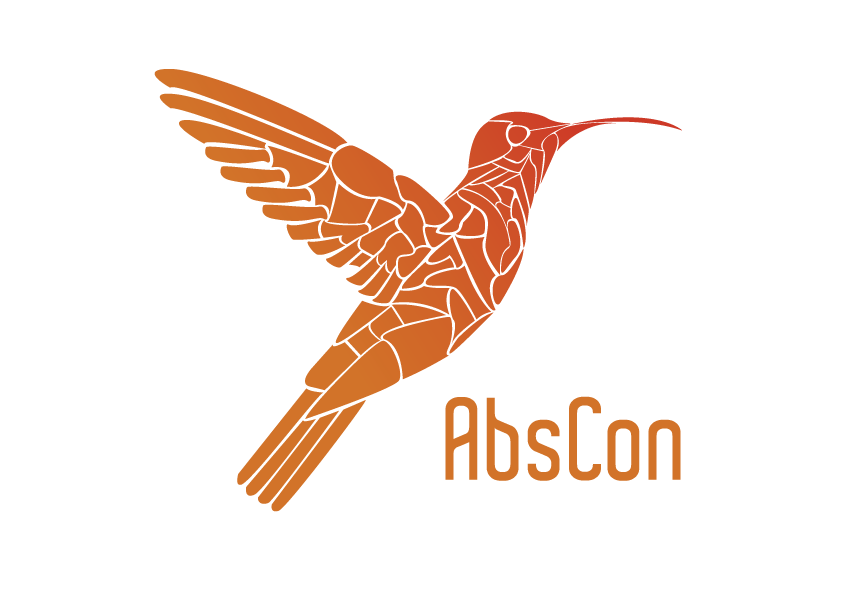

AbsCon is an open-source Java-written Constraint Solver, developed by Christophe Lecoutre (CRIL).

AbsCon focuses on:
- integer variables, including 0/1 (Boolean) variables,
- state-of-the-art table constraints, including ordinary, short, and smart table constraints,
- popular global constraints (allDifferent, count, element, cardinality, etc.),
- search heuristics (wdeg, impact, activity, last-conflict, cos, ...),
- mono-criterion optimization, including optimization over cost functions

AbsCon is distributed under License CeCILL (Copyright (c) 2000-2018, CRIL, Artois University).

## Building a JAR

1. clone the repository : `git clone https://forge.univ-artois.fr/christophe.lecoutre/AbsCon.git`
1. change directory : `cd AbsCon`
1. run Gradle : `gradle build -x test`  (of course, you need Gradle to be installed)
1. test the JAR : `java -jar build/libs/AbsCon-YY-MM.jar` where you give the right values for YY and MM.
If the usage of AbsCon is displayed, you are fine. 

With this JAR, you can run AbsCon on any XCSP3 instance.

## Running Unit Tests

1. run Gradle : `gradle test`
1. see results in `AbsCon/build/reports/tests/index.html`
